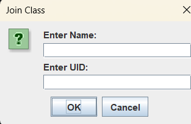
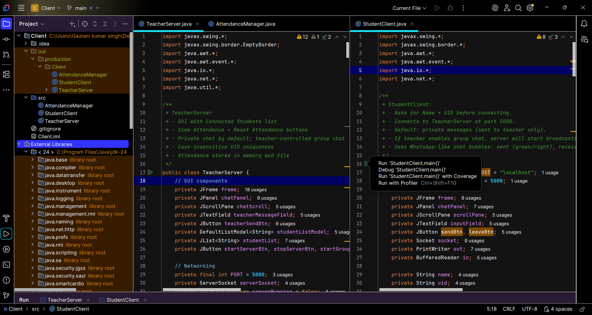

# 🧠 Real-Time Chat and Attendance System using Java

## 📘 Overview
This project is a **Real-Time Classroom Chat and Attendance System** developed using **Java Socket Programming** and **Swing GUI**.  
It enables seamless communication between teacher and students in a networked environment, while automatically marking attendance when students join the class.  
The system simulates a modern classroom similar to online platforms like Zoom or Google Classroom — but built entirely in **Java**.

---

## ⚙️ Features

- 👩‍🏫 **Teacher Dashboard** – Start/Stop Server, View Connected Students, Control Group Chat  
- 💬 **Private and Group Chat** – Teachers and students can communicate privately or in groups  
- ✅ **Automatic Attendance Marking** – Attendance is logged automatically when a student joins  
- 📁 **Attendance File Management** – Teacher can view or reset attendance using GUI buttons  
- 🎨 **Modern GUI Interface** – Built using Java Swing for an intuitive and responsive layout  
- 🔄 **Multithreading and Sockets** – Real-time communication between multiple users  
- 🔐 **UID Validation** – Each student joins with a unique ID for attendance tracking  

---

## 🧰 Tools & Technologies Used

| Tool | Purpose |
|------|----------|
| **Java (JDK 21)** | Core programming language |
| **Java Swing** | GUI design framework |
| **Socket Programming** | Enables real-time client-server communication |
| **Multithreading** | Handles multiple users simultaneously |
| **IntelliJ IDEA** | Integrated Development Environment |
| **File I/O** | For attendance logging |

---

## 🧩 Project Structure

📁 RealTime-Chat-And-Attendance-System
│
├── src
│ ├── TeacherServer.java # Server-side code (teacher dashboard)
│ ├── StudentClient.java # Client-side code (student interface)
│ ├── AttendanceManager.java # Attendance file management
│
├── .idea # IntelliJ project files
├── .gitignore
├── Client.iml

---

## 🚀 How to Run

### 1️⃣ Run the Teacher (Server)
1. Open IntelliJ IDEA.  
2. Run `TeacherServer.java`.  
3. Click **Start Server**.  
4. The teacher dashboard will open and wait for student connections.

### 2️⃣ Run the Student (Client)
1. Open another instance of IntelliJ (or run on another machine).  
2. Run `StudentClient.java`.  
3. Enter **Name** and **UID** when prompted.  
4. The client connects automatically to the teacher’s server.

---

## 📊 Output Screenshots

| Function | Screenshot |
|-----------|-------------|
| **Student Join Dialog** |  |
| **Teacher-Student Chat** |  |
| **Communication between Teacher & Student** |  |
| **IntelliJ IDE Code Setup** |  |

---

## 🧩 Future Enhancements

- 🗂️ Add **Database Integration** for attendance storage  
- 🎙️ Add **File Sharing** and **Voice Chat** support  
- 🔐 Implement **Authentication System** for secure login  
- 📊 Add **Classroom Analytics** for participation tracking  

---

## 🏁 Conclusion

This project demonstrates the implementation of **real-time communication, attendance tracking, and GUI-based management** using Java.  
It’s a compact and practical system that merges core computer science concepts — **networking**, **multithreading**, and **interface design** — into one educational tool.

---

### 👨‍💻 Developed by:
**Gautam Kumar Singh**  
Department of Computer Science & Engineering  
(Session: 2025)

